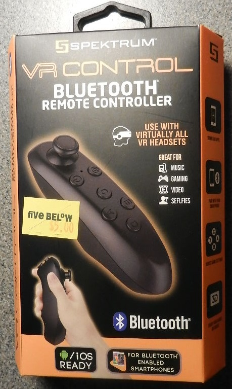
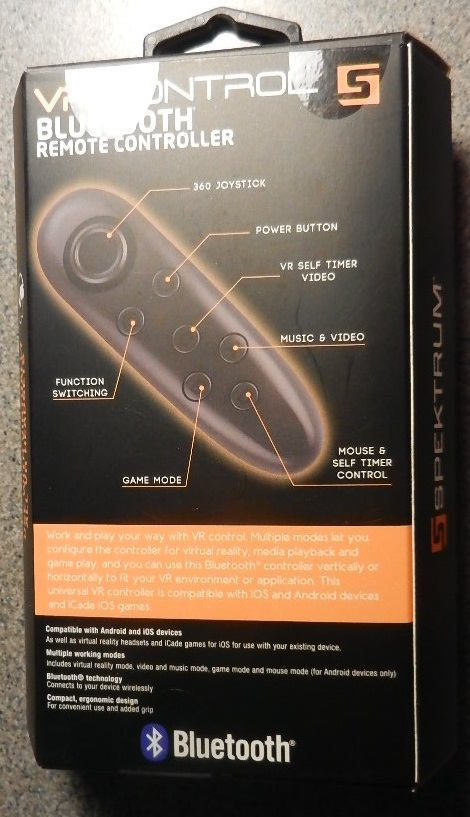
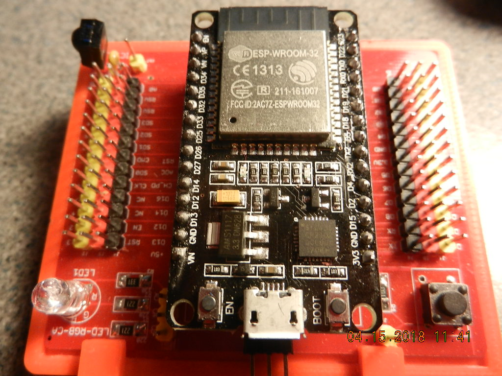

# ESP32 Bluetooth BLE Framework
This project is a framework for an ESP32 to use an inexpensive hand-held Bluetooth BLE joystick. The joystick is readily available on the Internet for less than $20.00 or from your local fiveBELoW store for $5.00. The code provided was written for the Arduino IDE Ver 1.8.5 with the ESP32 addon. 

# Instalation and Setup of the Arduino IDE
There are numerous web sites with detailed instructions for installing the Arduino IDE and the ESP32 addon. I am not going to attempt to repeat that information here. Google it and follow the directions.

# About the Framework
The framework is an adaptation of a BLE client example published by IoT Sharing (http://www.iotsharing.com/2017/07/how-to-use-arduino-esp32-ble-as-gatt-client.html). You can study this code to get an idea of how BLE works. Expressif has a complete example for a GATT BLE client and explains the operation in detail (not written for Arduino IDE). You can get it here: https://github.com/espressif/esp-idf/blob/9a98535/examples/bluetooth/gatt_client/tutorial/Gatt_Client_Example_Walkthrough.md.

I am calling this a framework because it provides all of the ESP32 code to do the Bluetooth communications with the joystick device. You will have to fill in what to do with the data received from the joystick device.

# About the Joystick
The joystick that is used is retailed as: VR Control, Bluetooth Remote Controller made by Spektrum. 

This is not a BLE tutorial. I will not be explaining how the code works in detail. I will use BLE terminology to describe some of the features of the joystick. The part of the code that you need to modify for your project will be explained in detail to help you to modify it. The scope is limited to keep this document as short as possible.

## Joystick BLE Description
The device has a joystick, two trigger buttons and six other buttons on the handle, four of which you can use. The joystick is a BLE Server with five BLE Services. The Framework is only interested in the BLE HID Service, which has ten BLE Characteristics. Some of the ten Characteristics are duplicates. The Framework is only interested in the BLE Report Characteristics that have Read & Notify capabilities. The Characteristics are thus limited to three Reports that have their Notifications enabled. The Notify capability means that when the Server detects a change in the joystick position of one of the buttons is pressed then a Notification message is sent with information about the change.

The Framework handles all of the dirty work of the BLE interface. The ESP32's Bluetooth radio is configured as a BLE Client (GATT Client). It then scans for a BLE Server named "VR BOX". Once found, it will connect to the Server, validate the HID Service is available and setup the appropriate Characteristics to use Notifications.

When the user moves the joystick or presses a button, the server sends a notification message to the client. The data field of the notification has the joystick value or the value of the button that was pressed. The framework parses the data from the notification meaasge stores it in memory and wakes up a FreeRTOS task to handle the data. When the data hasndler finishes consuming the data it goes back to sleep waiting for the next notification message. Three tasks are provided. One each for the joystick and trigger buttons, AB buttons and the CD buttons.

# Tasks
Each of the three tasks parses the data from the notification message and executes a sub-section of the code for a specific event. For example, the joystick task determines which direction the X & Y axes have moved in and runs the code that you provide to handle movement along the axes. In each task there is a comment; "//===== add your code here =====" to indicate where to add your code. There is also a coment and Serial.println() indication the event your handler should handle.

## Indicators
The Framework drives two LEDs. The GREENLED pin is used to light up a green LED to indicate when the Bluetooth is scanning for a Server. The BLUELED pin is used to light up a blue LED when the connection to the Server is established. These pins are determined by #include statements. You can change the pins by changing the pin numbers.

The Framework will scan for the Server for thirty seconds. If the "VR BOX" Server is not found then the green LED turns off. After a five second delay, the green LED lights up and another scan is tried. This goes on until the "VR BOX" Server is found and a connection is made.

Once connected to the Server, the blue LED is lit up. If the connection is lost the Framework goes back to scanning for the Server. The ESP32 is reset to start the Bluetooth stack over. Currently the ESP32 has no method to re-run a scan after a connection has been made.

# VR BOX Operation
## Joystick
If the joystick is left in the center position, no joystick notifications are sent. Once the joystick is moved off center, a notification message with joystick data and trigger button data is sent about every 15mS. When the joystick is moved back to center, a notification that it has moved to center is not sent. In other words, it tells you the joystick has moved off center, but not that it has moved to center. The end result is that you receive messages indicating the joystick is moving toward center, but not that it has reached center. Very annoying. The two trigger buttons are included with the joystick data. Pressing one of the trigger buttons after returning the joystick to center will update the joystick position to zero. The Framework has a timeout timer built-in to it that automatically simulates a joystick notification message a short time after all joystick/trigger button notification messages stop arriving. The timer sets the joystick to zero. The joystick has a range of about +/- 25 on each axis.

## Trigger Buttons
The trigger buttons will send a notification message once when pressed and again when released. The pressed notification message will indicate the button that was pressed. The release notification message indicates that both buttons are released.

Holding the lower trigger button will prevent the server from detecting that the upper trigger button has been pressed. Holding the upper trigger button and pressing the lower trigger button results in the server sending a notification message that the lower trigger button is pressed (the upper trigger button will be zero!). Releasing the lower trigger button will cause the server to send a notification that the upper trigger button is pressed and the lower trigger is released.

In other words, the lower trigger button is dominant over the upper trigger button and will override it when both are pressed. You have to determine how to handle the case of both buttons being pressed.

## A/B Buttons
The A and B buttons act like the joystick and continuously send notification messages when pressed and held down. The messages stop when the button is released.

The A and B buttons work similar to the Trigger buttons in that the A button dominates the B button just like the lower trigger button dominates the upper trigger button.  

## C/D Buttons
The C and D buttons send a notification message once when pressed and again when released. If held down, no further messages are sent until they are released.

Holding down either one of the C or D buttons will prevent the server from detecting activity on the other button. 

## General
All of the buttons are bit mapped into one byte of the associated notification message. 

The operation of the buttons is in my opion a little wonky. The Framework provides for places to put your code to act on when a button is pressed. If you also need to detect button releases, that is left for you to figure out how to do. 

# Conclusion
It is entirely up to you to determine what you want each button to do and what moving the joystick should do. How you handle the differences in the trigger, A & B and the C & D buttons is up to you.

Look in the code for the; taskJoyStick(), taskButtonAB(), taskButtonCD() functions and add your code after the "//===== add your code here =====" comment.

You will need upto four functions to handle the joystick (forward, backward, right & left) and up to six functions to handle the various buttons. Implement them all or just what you need. The choice is yours.

Enjoy
